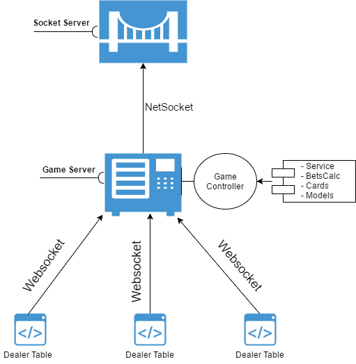

# Game Server

> Handling game mechanics as initialized by the dealer page


Uses `websockets` [socket.io](https://socket.io/) and `TCP/netsockets` [net](https://nodejs.org/api/net.html) package libraries for [NodeJS](https://nodejs.org).



## Installation
```sh
git clone https://escorido@gitlab.com/escorido/server-setup.git
cd <YOURROOTFOLDER>/server-setup/game-servers/
npm install
```
## Usage
``` sh
node server.js
```
## Contributing

1. Fork it
2. Create your feature branch
3. Commit your changes
4. Push to the branch
5. Create a new Pull/Merge Request