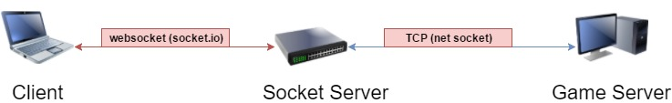

# Socket Server

> Acting as **socket/stream gateways** for all game servers and clients.


Uses `websockets` [socket.io](https://socket.io/) and `TCP/netsockets` [net](https://nodejs.org/api/net.html) package libraries for [NodeJS](https://nodejs.org).



## Installation
```sh
git clone https://escorido@gitlab.com/escorido/server-setup.git
cd <YOURROOTFOLDER>/server-setup/socket-servers/
npm install
```
## Usage
``` sh
node server.js
```

## Development Setup

 - Specify config data on *<location>/server-setup/socket-servers/config/index.js*.

 - Set Redis adapter.

```javascript
io.adapter( redis( { host : redisHostString, port : redisPortInteger } ) );
```

 - Define your client socket `gameModule` _( The websocket server )_ /server.js.

```javascript
let sampleGame = new Game( io.of( '/namespace' ), connectedUsersArray, gameNameString, serverNameString )
```

 - Define your tcp connection to game server: `tcpModule`.

```javascript
let tcp = new TcpServer( portInteger, hostString, gameNameString )
```

 - Combine **webSocket** ( Game instance ) and **TCP** ( TcpServer instance ).

```javascript
tcp.gameModule[ sampleGame.name ] = sampleGame;
```
## Client Emitters

### 'init( { userid, tableid } )'

Triggers the server to look for current round datas.

### 'jointable( tableid, [ callback ] )'

Triggers the server to have the *'current client's connected socket'* get registered to a room.

## Client Listeners

#### Event: 'swipecard'

Emitted when a card or dealer card is swiped / scanned.

#### Event: 'command'

Emitted when dealer presses the command actions _ex: numpad (6) to stop timer_.

#### Event: 'newround'
	
Emitted during the start of a new round.

#### Event: 'displayresults'

Emitted during the dealer displays the result of every round.

#### Event: 'activerounddatas'

Emitted as a response after emitting the *'init'* event.

#### Event: 'dealerchange'

Emitted during a dealer change

## Contributing

1. Fork it
2. Create your feature branch
3. Commit your changes
4. Push to the branch
5. Create a new Pull/Merge Request